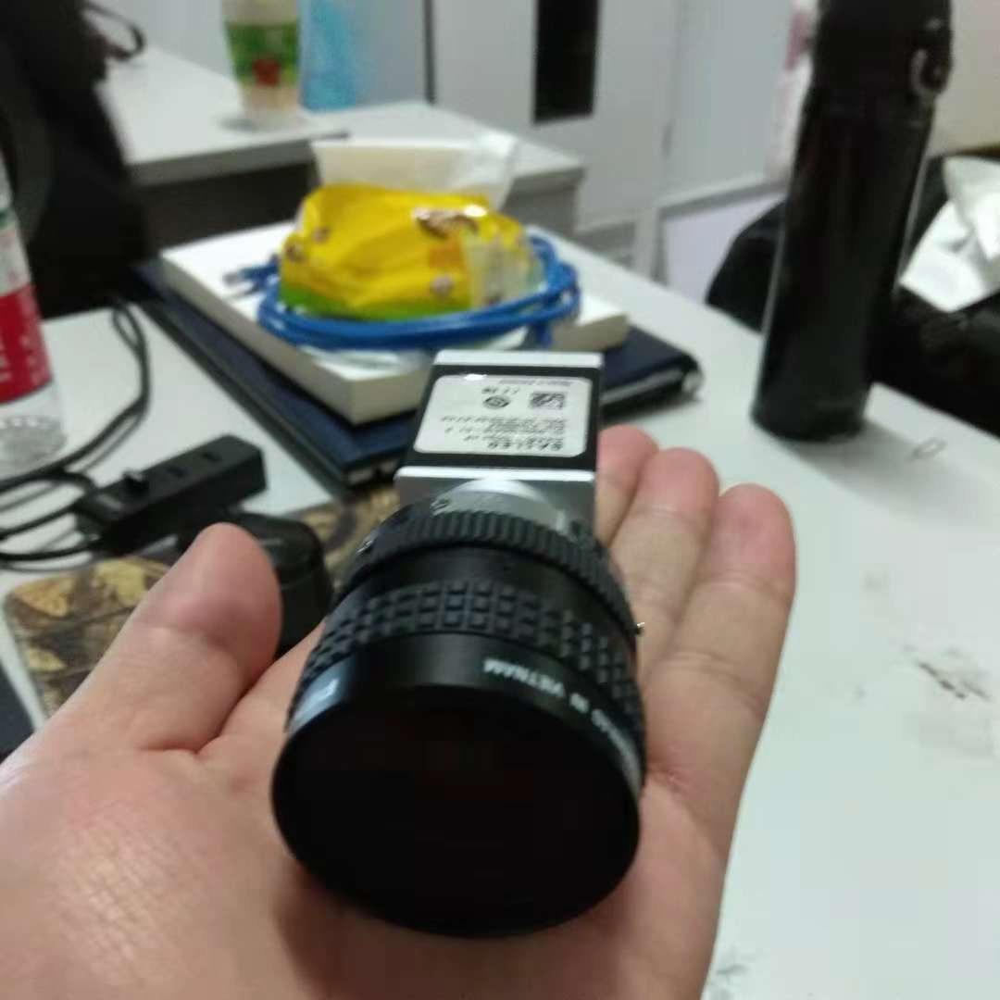

    <h1>
    	Code-Detection
	</h1>
	

## About
基于Halcon视觉库的条形码识别软件开发

## Catalogue

- 39codeBar

   * 该应该用于检测39条形码，将图纸上的39条形码识别并保存为本地文件

- CodeBar

   * 该应用用于识别图片内的条形码与二维码

- ORC

   * 图像中商品条码中的字符识别

## Tools

Halocon 12.02 &  Genie SDK：
<https://pan.baidu.com/s/1Wyf21IAeBMCKpqCLOwUg3g>